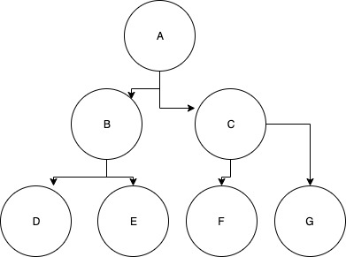

# glas-data-programming-challenge

> Please complete the challenge outlined below.

Given the following relational object structure:

```
{
	id: "unique_id",
	parentId: "another_id"
}
```

Build a linked list, or "parent tree". 

# Example 1:

### Input:

```
[
	{
		id: "one",
		parentId: null
	},
	{
		id: "two",
		parentId: "one"
	},
	{
		id: "three",
		parentId: "two"
	},
	{
		id: "four",
		parentId: "two"
	}
], // the array of objects in any order
-1 // the depth to which to build the tree
```

### Output:

```
{
	one: {
		id: "one",
		parentId: null,
		children: ["two"]
	},
	two: {
		id: "two",
		parentId: "one",
		children: ["three", "four"]
	},
	three: {
		id: "three",
		parentId: "two":
		children: []
	},
	four: {
		id: "four",
		parentId: "two",
		children: []
	}
}
```

# Description

The solution should be a function that takes two arguments:

* An array of objects in any order
* A depth parameter specifying to which depth the tree should be built


Given the following object structure:



Where A is the parent node, B & C are level 1 children, and D, E, F & G are level 2 children:

* A depth parameter of 0 results in an empty object
* A depth parameter of 1 results in a parent tree consisting only of A, B & C
* A depth parameter of 2 results in the entire parent tree
* A negative depth parameter indicates there are no limits to the tree

# Scenarios

* [scenario 1](./scenario1.json)
* [scenario 2](./scenario2.json)
* [scenario 3](./scenario3.json)
* [scenario 4](./scenario4.json)
* [scenario 5](./scenario5.json)
* [scenario 6](./scenario6.json)
* [scenario 7](./scenario7.json)
* [scenario 8](./scenario8.json)

# Notes

Consideration will be taken for:

* Ability to deal with edge cases and bad data sets
* Performance (O notation)
* Readability and code cleanliness
* Testability
